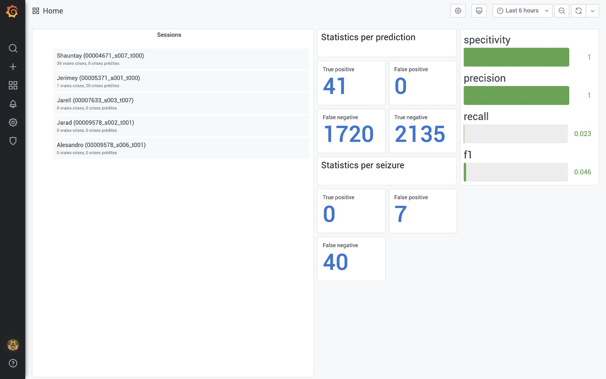
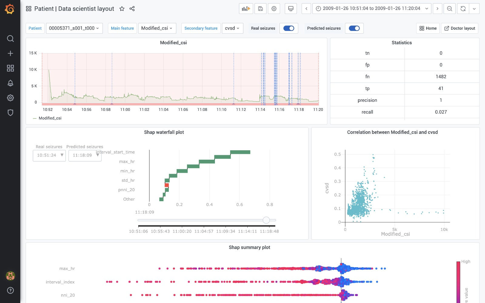
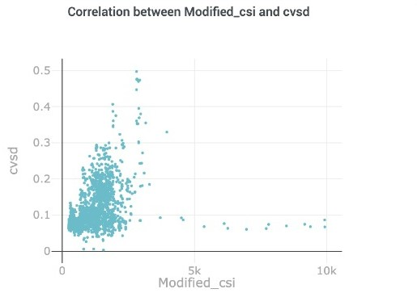

# Technical doculentation 

## 1 Project description 

### 1-1 Problem definition 

   The application of artificial intelligence in the medical field requires a high level of reliability. Given the great consequences that a false prediction can have on the quality of life of patients, it has become essential to use analysis tools that allow the __data scientist__ to optimize their utility.

   Otherwise, using a diagnostic tool based on artificial intelligence can generate mistrust among __doctors__ because these algorithms are generally difficult to understand at first glance due to their complexity. However, doctors must absolutely have confidence in these algorithms since they are responsible for letting their patients use the tool. To generate this confidence in the solution, it is therefore important that doctors understand the underlying mechanisms of the algorithm.

### 1-2 stakeholders

__Data scientist team__ : The first stakeholder of our project is the data scientist team who wants to improve the performance and accuracy of their Machine Learning algorithm to ensure its proper functioning through a good understanding and deep analysis of the explanations of how the algorithm works. Their final goal is to present their model to the doctor, explain it and gain their confidence in the model.

__Doctors__ : The second stakeholder is the doctors team, we need to provide them with an understandable and transparent solution to generate confidence in the solution.

### 1-3 Choice of explication type

   Our solution must be adapted to both stakeholders of our project, hence we have chosen to provide the following explanations:

   - _Explanation of the prediction :_ The model returns a prediction accompanied by the explanation concerning this precise prediction.
   - _Model analysis:_ The explanation consists of an analysis of the model in according to the input features.

### 1-4 Requirements 
   After having fixed the types of explanations to be provided, it is also necessary to ensure that our solution is useful on the long term for our customer, that's why we have fixed to our algorithm the following requirements: 
   - _Readability:_ The user must be able to take in hand our tool as easily as possible, therefore our graphic explanations must be well titled, equiped with color codes and legends...
   - _Fluidity:_ Our tool must be fluid despite the large size of the data, the waiting time of the user must also be limited to ensure the proper use of the tool.
   - _Resilience:_ The tool must resist to a change of model (model agnostic) as well as being adapted to the two databases TUH and TEPPE.

## 2- General architecture of the project 

 Figure.1: General architecture of the project 

<html>

### 2-1 Input Data 
The initial database we used is different from the one used by Aura for confidentiality reasons. At first we used a public database with the model trained on their database, but we got unsatisfying results and explanations . For that, we decided to train the model on our database in order to improve the quality of our tool and to have more significant explanations of the functioning of the model.

### 2-2 The explainability pipeline 
For the explainability pipeline we used Lime and SHAP, two Python libraries for model explainability. 

**Lime :**  local Interpretable Model-agnostic Explanations, it allows us to build a linear model around each prediction to explain how the model works locally.

- Lime allows on the one hand to facilitate the interpretability of the model thanks to the approximation with a linear model, and on the other hand to have a 'local fidelity', i.e. we will know which are the most important features for a local prediction since this may be different from the globally important features of the model.

-  This would be useful when studying the predictions of the model for a specific patient.

**Shap :** Shapley Additive exPlanation, by using the 'Shapley values' it allows us to know the global importance of the variables and especially the effect of the variables for each example of the dataset.

-However, the huge advantage of SHAP is that the technique allows to have a more precise information for each data. Also, it offers several types of graphs (waterfall plot, beeswarm plot, dependence plot...).

### 2-3 base de donnée intermédiare

The intermediate database allows us to link the explicability pipeline and the input data for the visualization interface. It will allow us to store all the necessary data and calculations in advance in order to guarantee the fluidity of our tool. 

### 2-4 Visualization interface 

**Grafana :**  is a data visualization tool that allows you to create dashboards and graphs from several sources including temporal databases like InfluxDB.

We used Grafana as our visualization tool since it is the tool used by Aura and it allowed us to do the visualizations we needed so we decided to keep it.

## 3- Detailed architecture of each entity

 Figure.2: Detailed architecture of each entity 

<html>

- La pipeline 1 : to extract features from the initial database (TUH).
- La pipeline 2 : to train the model on our public database.
- La pipeline 3 : to provide explanation data with Lime and shap as well as predictions in .csv format.
- La pipeline 4 : or the creation of graphs and plots that will be represented on Grafana's dashbords.

### 3-1 Database and trained model

- The database "Electroencephalography (EEG) Resources" that we used in our study is available on this [link](https://isip.piconepress.com/projects/tuh_eeg/html/downloads.shtml"). 

-In a first step we used the Random Forest model that was trained by Aura with the above mentioned database as input to our explainability pipeline.
- This model can change without having any impact on the operation of the explainability pipeline under certain conditions which will be specified in the part dedicated to the explainability pipeline.

### 3-2 The explainability pipeline

As we explained, we used Lime and Shap for the explicability part of the model. In the following we will specify the special features and configurations of these libraries.

**Shap :** We used *Shap.TreeExplainer* to explain the output of our tree model, and therefore in the case where the ML model needs to be modified we will distinguish between two cases:

- ***if it is a The tree-based machine learning model :***  

You do not have to change anything in the code because [*Shap.TreeExplainer*](https://shap-lrjball.readthedocs.io/en/latest/generated/shap.TreeExplainer.html") support XGBoost, LightGBM, CatBoost, Pyspark and most of the scikit-learn tree models.

- ***if it's another type :***

 You have to change in the shap.TreeExplainer code by the Explainer that corresponds to your model type. Here is the list with the links of the different other explainers available in Shap : "[shap Gradient Explainer](https://shap-lrjball.readthedocs.io/en/latest/generated/shap.GradientExplainer.html"), [shap Deep Explainer](https://shap-lrjball.readthedocs.io/en/latest/generated/shap.DeepExplainer.html"), [shap Kernel Explainer](https://shap-lrjball.readthedocs.io/en/latest/generated/shap.KernelExplainer.html"), [shap Sampling Explainer](https://shap-lrjball.readthedocs.io/en/latest/generated/shap.SamplingExplainer.html"),  [shap Partition Explainer](https://shap-lrjball.readthedocs.io/en/latest/generated/shap.PartitionExplainer.html"), [shap Linear Explainer](https://shap-lrjball.readthedocs.io/en/latest/generated/shap.LinearExplainer.html"), [shap Permutation Explainer](https://shap-lrjball.readthedocs.io/en/latest/generated/shap.PermutationExplainer.html") et  [shap Additive Explainer](https://shap-lrjball.readthedocs.io/en/latest/generated/shap.AdditiveExplainer.html") ".

 **Lime :** for Lime, while the model is a scikit-learn model, we don't have to change anything in the code by changing the model.
 ### 3-4 Grafana 

 We have made two types of Dashbord Grafana according to the profile of the user of the tool:

 - *Data Scientist :* in order to customize the 'data scientist layout' according to the expectations of this user profile. We have decided to put graphs and figures that give information about the performance and functioning of the prediction algorithm.

 - *Doctors :* The 'doctor layout' will contain the data that makes the most sense to doctors for epilepsy prediction as well as the graphs that show the features that the model relied on to make such a decision so that they can see if the algorithm is using the right criteria in its reasoning.
 #### 3-4-1 Home layout

 In this layout, we decided to put the list of patients that will allow the user to select the patient. In order to visualize the graphs of the features and the graphs of the explainability linked to this prediction. As well as the statistics related to the global performance of the model.

 > 

 Figure.3: Home layout  

<html>

> We don't have enough positive predictions and they are all correct predictions. Because the public dataset with which we trained our model contains few '1's (few real crisis) and also the trained model was not very efficient. That's why we have low values in some metrics.

>for the statistics related to the crisis predictions, we have 0 because the periods of the predicted crises were not sufficiently correct to consider that the prediction of the crisis was correct. Indeed the proportion of points on which the model predicts a crisis compared to the number of points of the real crisis must be higher than 75% to be considered correct.

#### 3-4-2  Data scientist layout

 Figure.4: Data scientist layout  

<html>

In this Dashboard we have put all the graphs related to the features and that will allow the data scientist to better understand the functioning of the algorithm and improve it. It is made of :
- ***Navigation bar:***  
>

 Figure.5: Navigation bar 

<html>
 This bar consists of a first button 'session' which indicates the name of the active session of the patient with a drop-down list to modify it. A second drop-down list with all the features to choose the main feature (the graphs will be modified according to the choice of this feature). Then a third drop-down list of features to choose the feature with which you want to study the correlation. The buttons 'Real seizures' and 'Predicted seizures' allow us to display on the first graph the interval of the predicted seizure and that of the real seizure. Finally, in the right end we have the buttons that allow us to access the home dashboard and the one dedicated to the doctors.

 - ***Statistics sheet:*** 
  In this sheet we have the key indicators of the model.

 Figure.6: Statistics sheet  

<html>

- ***graphic representations :*** 

> 1. *Evolution of the feature as a function of time.*
> 

 Figure.7: evolution of feature 'modified_csi' as fonction of time   

<html>

This is the first graph of the Dashbord, we can zoom on this graph in order to select the window of time that we want to visualize, as well as we can display the duration of each crisis by passing the mouse on the real crisis that is represented by red lines.

> 2. [*Shap waterfall plot*:](https://shap-lrjball.readthedocs.io/en/latest/generated/shap.waterfall_plot.html#:~:text=The%20waterfall%20plot%20is%20designed%20to%20visually%20display,prediction%20given%20the%20evidence%20of%20all%20the%20features.) CeThe graph is designed to display how the Shap value of each feature modifies the output, in other words it highlights the importance of the features. We can select the feature to study in the 1st button of the navigation bar.
> 

 Figure.8: Shap waterfall plot   

<html>

> The slider will allow us to modify the display time.

> The button 'Real seizures' allows us to display the moment of the beginning of the real seizure, and the button 'Predicted seizures' allows us to display the moment of the beginning of the predicted seizure.

> 3. *Features dependency:* This graph represents the feature selected in the 'main feature' button according to the second selected feature in order to see if there is a dependency relationship between the two features. 
> 

 Figure.9:Correlation plot   

<html>

> 4. [*Shap summary plot:*](https://shap-lrjball.readthedocs.io/en/latest/generated/shap.summary_plot.html) It creates a beeswarm plot, the shap values are represented on the x axis, the feature names on the y axis and each point is colored with a gradient from red to blue to represent the value of the feature. In this plot we will put the features that have the highest variance and it will not depend on the choice of the feature in the selection bar.

> 

 Figure.10: Summary plot avec notre modèle 

<html>

#### 3-4-3 Dashbord médecin 

> 

 Figure.11: Doctor Dashbord 

<html>

In this Dashbord we have put all the graphs that can allow doctors to make an analogy between the reasoning of the ML algorithm and their own reasoning regarding the detection of epileptic seizures. It consists of :
- ***Patient sheet:*** This sheet will allow them to identify the patient and will contain information such as ( Name, First name, Age, sex..).

- ***Graphical representations:*** 
> 1. *Evolution of ECGs :* 
> 
   

 Figure.12: ECG diagram 

<html>
In this plot we have deactivated the display of the real and predicted seizure windows, that's why you don't see the red and blue lines 

> 2. *Evolution of the features as a function of time.*
> 3. *LIME graph :* Ce graphique nous permet de représenter le poids que le modèle ML donne à chaque feature et donc l'importance de celle-ci. Nous avons choisi ce graphe car il est facile à interpréter et compréhensible vu que Lime propose des explications aisément compréhensibles.
> 

 Figure.13: Lime graph 

<html>

>Le slider en bas du graphe nous permettra de modifier l'instant d'affichage

### 4- Interactions

#### 4-1 Sequence chart for the doctor

The interaction with our tool when the user is the Doctor is as follows: 

 
   

 Figure.14: Sequence chart 

<html>

#### 4-2 Sequence diagram for the data scientist
The interaction with our tool when the user is the data scientist is as follows: 

 

   

 Figure.15:saquence chart 

<html>
