# Technical documentation

## 1 Project description

### 1-1 Problem definition

The application of artificial intelligence in the medical field requires a high level of reliability. Given the great consequences that a false prediction can have on the quality of life of patients, it has become essential to use analysis tools that allow the **data scientist** to optimize their utility.

Otherwise, using a diagnostic tool based on artificial intelligence can generate mistrust among **doctors** because these algorithms are generally difficult to understand at first glance due to their complexity. However, doctors must have confidence in these algorithms since they are responsible for letting their patients use the tool. To generate this confidence, it is therefore important that doctors understand the underlying mechanisms of the algorithm.

### 1-2 Stakeholders

**Data scientist team:** The first stakeholder of our project is the data scientist team who wants to improve the performance and accuracy of their Machine Learning algorithm to ensure its proper functioning through a good understanding and deep analysis of the explanations of how the algorithm works. Their final goal is to present their model to the doctors, explain it and gain their confidence in the model.

**Doctors:** The second stakeholder is the medical team. We need to provide them with an understandable and transparent solution to generate confidence in the solution.

### 1-3 Choice of explanation type

Our solution must be adapted to both stakeholders of our project, hence we have chosen to provide the following explanations:

- _Explanation of the prediction:_ The model returns a prediction accompanied by its explanation.
- _Model analysis:_ The explanation consists of an analysis of the model according to the input features.

### 1-4 Requirements

After having fixed the types of explanations to be provided, it is also necessary to ensure that our solution is useful in the long term for our customer, that's why we have fixed to our algorithm the following requirements:

- _Readability:_ The user must be able to use our tool as easily as possible, therefore our graphic explanations must be well titled, equipped with color codes and legends, etc.
- _Fluidity:_ Our tool must be fluid despite the large size of the data, the waiting time of the user must also be limited to ensure the proper use of the tool.
- _Resilience:_ The tool must be adaptable to a change of model (model-agnostic) as well as being adapted to the two databases TUH and TEPPE.

## 2 General architecture of the project

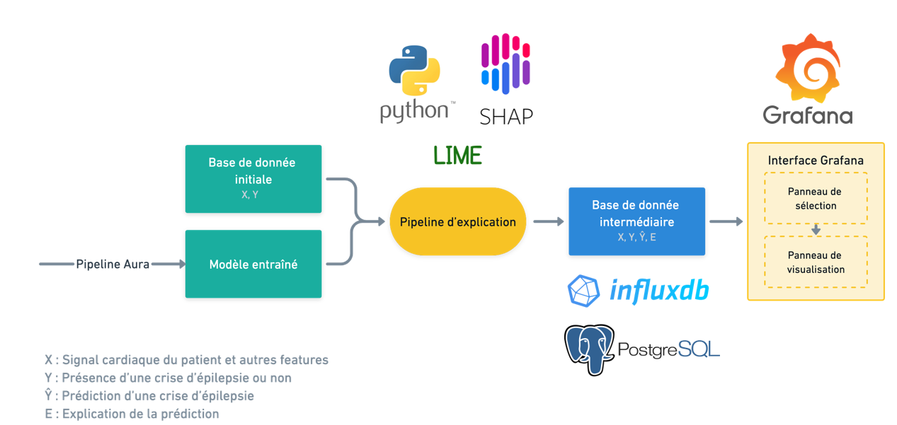

 Figure.1: General architecture of the project 

### 2-1 Input Data

The dataset we used is different from the one used by Aura for confidentiality reasons. At first, we used a public dataset with the model trained on their (confidential) dataset, but we got unsatisfying results and explanations. Due to that, we decided to train the model on our dataset, so that the model would perform better, leading to better explanations.

### 2-2 The explainability pipeline

For the explainability pipeline, we used Lime and SHAP, two Python libraries for model explainability.

**Lime** (Local Interpretable Model-agnostic Explanations): it allows us to build a linear model around each prediction to explain how the model works locally.

- Lime on the one hand facilitates the interpretability of the model thanks to the approximation with a linear model, and on the other hand, allows us to have "local fidelity", i.e. we will know which are the most important features for a local prediction, since this may be different from the globally important features of the model.

- This would be useful when studying the predictions of the model for a specific patient.

**SHAP** (Shapley Additive exPlanation): by using the "Shapley values", it allows us to know the global importance of each variable and especially the effect of the variables for each example of the dataset.

- However, the huge advantage of SHAP is that the technique gives more precise information for each observation. Also, it offers several types of graphs (waterfall plot, beeswarm plot, dependence plot, etc.).

### 2-3 Intermediate database

The intermediate database allows us to link the explainability pipeline and the input data to the visualization interface. It allows us to store all the necessary data and calculations in advance to guarantee the fluidity of our tool.

### 2-4 Visualization interface

**Grafana** is a data visualization tool that enables the creation of dashboards and graphs from several sources including temporal databases like InfluxDB.

We used Grafana as our visualization tool since it is the tool used by Aura and it allowed us to do the visualizations we needed.

## 3- Detailed architecture of each entity

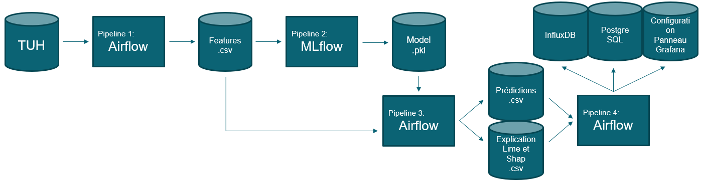

 Figure.2: Detailed architecture of each entity 

The pipeline is composed of 4 sub-pipelines:

- Pipeline 1: extracts features from the dataset (TUH or TEPPE).
- Pipeline 2: trains the model on the extracted features.
- Pipeline 3: provides explanation data using Lime and SHAP, as well as predictions in csv format.
- Pipeline 4: stores the data in PostgreSQL and InfluxDB databases to enable the creation of graphs and plots on Grafana's dashboards.

### 3-1 Database and trained model

- The dataset "Electroencephalography (EEG) Resources" that we used in our study is available on this [link](https://isip.piconepress.com/projects/tuh_eeg/html/downloads.shtml).
- In our testing, we used the Random Forest model that was trained by Aura with the above-mentioned database as input to our explainability pipeline.
- This model can change without having any impact on the operation of the explainability pipeline under certain conditions, which will be specified in the section dedicated to the [explainability pipeline](#3-2-the-explainability-pipeline).

### 3-2 The explainability pipeline

As we explained, we used Lime and SHAP for the explainability part of the model. In the following, we will specify the special features and configurations of these libraries.

**SHAP:** We used `shap.TreeExplainer` to explain the output of our tree model, and therefore in the case where the ML model needs to be changed, we will distinguish between two cases:

- **If it is a tree-based machine learning model:**

  You do not have to change anything in the code because [`shap.TreeExplainer`](https://shap-lrjball.readthedocs.io/en/latest/generated/shap.TreeExplainer.html) supports XGBoost, LightGBM, CatBoost, Pyspark, and most of the scikit-learn tree models.

- **If it's another type of model:**

  You have to replace the `shap.TreeExplainer` with the Explainer that corresponds to your model type. The following explainers are available in [`shap`](https://shap-lrjball.readthedocs.io/en/latest):

  - [`shap.GradientExplainer`](https://shap-lrjball.readthedocs.io/en/latest/generated/shap.GradientExplainer.html)
  - [`shap.DeepExplainer`](https://shap-lrjball.readthedocs.io/en/latest/generated/shap.DeepExplainer.html)
  - [`shap.KernelExplainer`](https://shap-lrjball.readthedocs.io/en/latest/generated/shap.KernelExplainer.html)
  - [`shap.SamplingExplainer`](https://shap-lrjball.readthedocs.io/en/latest/generated/shap.SamplingExplainer.html)
  - [`shap.PartitionExplainer`](https://shap-lrjball.readthedocs.io/en/latest/generated/shap.PartitionExplainer.html)
  - [`shap.LinearExplainer`](https://shap-lrjball.readthedocs.io/en/latest/generated/shap.LinearExplainer.html)
  - [`shap.PermutationExplainer`](https://shap-lrjball.readthedocs.io/en/latest/generated/shap.PermutationExplainer.html)
  - [`shap.AdditiveExplainer`](https://shap-lrjball.readthedocs.io/en/latest/generated/shap.AdditiveExplainer.html).

**Lime:** for Lime, as long the model is a scikit-learn model, you don't have to change anything in the code.

### 3-4 Grafana

We have made two types of Grafana dashboards according to the profile of the user of the tool:

- _Data Scientists:_ in order to customize the "data scientist dashboard" according to the expectations of this user profile, we have decided to put graphs and figures that give information about the performance and functioning of the prediction algorithm.

- _Doctors:_ the "doctor dashboard" will contain the data that makes the most sense to doctors for epilepsy prediction, as well as information about which features the model relied on to make its decision. Together, this information will allow the doctors to see if the algorithm is using the right criteria in its reasoning.

#### 3-4-1 Home dashboard

In this dashboard, we decided to display a list of patients, allowing the user to jump to the specific dashboard of each patient (as described below). This dashboard also shows statistics related to the global performance of the model.

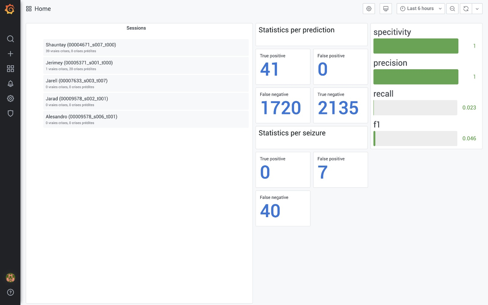

 Figure.3: Home dashboard 

Looking at the figure above, we can make the following remarks:

- For the statistics per prediction:

  - There are few positive predictions, all of which are correct (high precision).
  - There are many false negatives (low recall).

  This indicates that the model is strongly biased towards false (no seizure) predictions. Two possible explanations for this behavior are: the training dataset was extremely unbalanced, with very '1' labels (few real seizures), and the trained model was too simple to correctly capture the nuances of seizure prediction.

- For the statistics per seizure:

  - For these statistics, we considered a seizure (i.e. a period during which the label is always '1') to be correctly predicted if the model predicts '1' during at least 75% of the seizure.
  - Since the model was too biased toward predicting '0', it never managed to correctly predict a seizure (i.e. TP=0).

#### 3-4-2 Data scientist dashboard

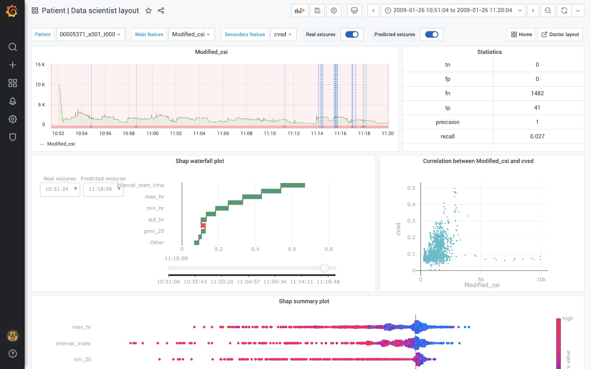

 Figure.4: Data scientist dashboard 

In this dashboard, we have put information that will allow the data scientist to better understand the functioning of the algorithm and improve it. It is made of:

- **_Navigation bar:_**

  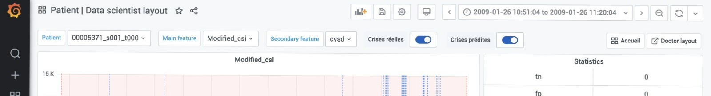

  

 Figure.5: Navigation bar 

  This bar consists of a first button "Patient" which indicates the name of the active session of the patient with a drop-down list to modify it.

  A second drop-down list "Main feature" can be used to select the feature which will be in the first graph. Finally, a third drop-down list "Secondary feature" can be used to select a second feature. The correlation between the main and secondary features is displayed in the dashboard through a scatter plot.

  The buttons 'Real seizures' and 'Predicted seizures' allow the user to control whether the intervals of the real and predicted seizures are shown in the first graph. Finally, at the right, there are navigation buttons that lead to the home dashboard and the one dedicated to the doctors.

- **_Statistics sheet:_**
  In this sheet, we have the key indicators of the model.

  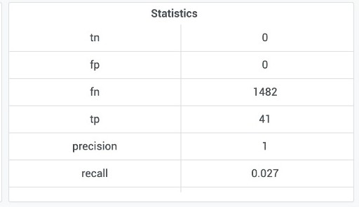

  

 Figure.6: Statistics sheet 

- **_Graphic representations:_**

  1. _Evolution of the feature as a function of time._

     This is the first graph of the Dashboard. We can zoom on this graph to select the window of time that we want to visualize, as well as view the duration of each seizure by passing the mouse on the real seizure that is represented by red lines.

     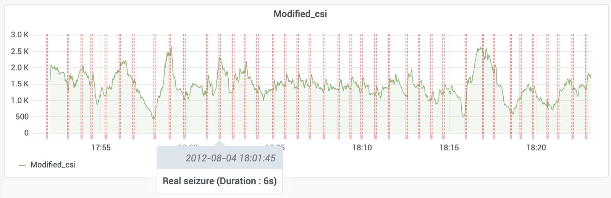

     

 Figure.7: evolution of feature 'modified_csi' as a function of time 

  2. [_SHAP waterfall plot_](https://shap-lrjball.readthedocs.io/en/latest/generated/shap.waterfall_plot.html)

     This graph is designed to display how the SHAP value of each feature modifies the output, in other words, it highlights the importance of each feature.

     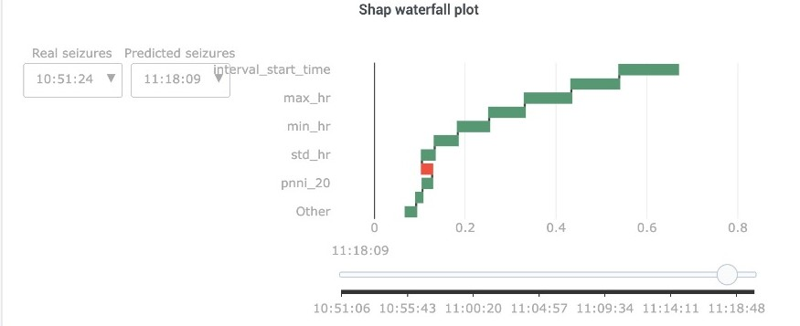

     

 Figure.8: SHAP waterfall plot 

     The slider allows us to control which prediction is being explained in the waterfall plot (the plot explains a single prediction in time).

     The button "Real seizures" allows us to select the moment of the beginning of a real seizure, and the button "Predicted seizures" allows us to display the moment of the beginning of a predicted seizure.

  3. _Feature dependencies_

     This graph represents the relationship between the main and secondary features selected in the navigation bar, allowing us to see if there is a dependency/correlation between the two features.

     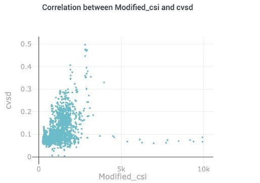

     

 Figure.9: Scatter plot of the main and secondary features 

  - 4. [_SHAP summary plot_](https://shap-lrjball.readthedocs.io/en/latest/generated/shap.summary_plot.html)

    This is a beeswarm plot. The SHAP values are represented on the x-axis, the feature names are on the y-axis and each point is colored with a gradient from red to blue to represent the value of the feature. In this plot, we will put the features that have the highest variance and it will not depend on the choice of the feature in the selection bar.

    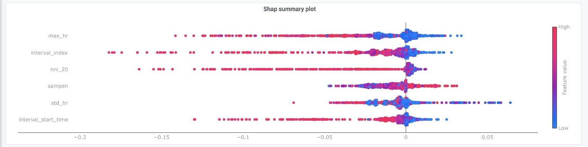

      

 Figure.10: Summary plot 

#### 3-4-3 Doctor dashboard

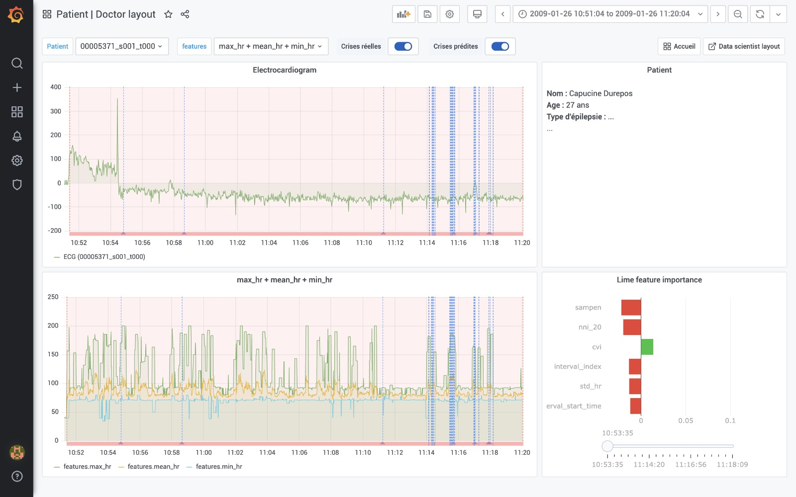

 Figure.11: Doctor Dashboard 

In this dashboard, we have put all the graphs that can allow doctors to make an analogy between the reasoning of the ML algorithm and their own reasoning regarding the detection of epileptic seizures. It consists of:

- **_Patient sheet:_** This sheet will allow them to identify the patient and will contain information such as first and last name, age, and sex.

- **_Graphical representations:_**

  1. _Evolution of ECGs_

     In this plot, we have deactivated the display of the real and predicted seizure windows, that's why you don't see the red and blue lines

     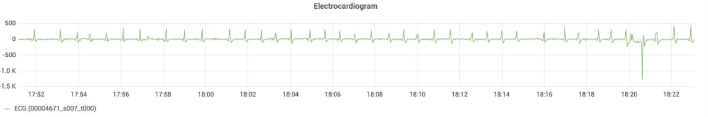

     

 Figure.12: ECG diagram 

  2. _Evolution of the features as a function of time_

  3. _Lime graph_

     This plot shows the weights given by the machine learning model to each feature, i.e., the feature importances. We've chosen this graph because it's easily interpretable and understandable, as is usual with Lime's explanations.

     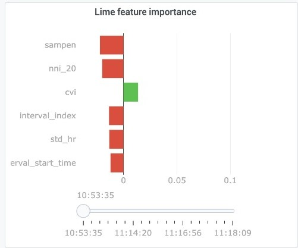

     

 Figure.13: Lime graph 

     The slider allows us to control which prediction is being explained in the graph.

### 4- Interactions

#### 4-1 Sequence diagram for the doctor

The interaction with our tool when the user is the doctor is as follows:

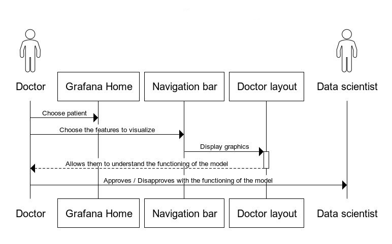

 Figure.14: Sequence diagram for the doctor 

#### 4-2 Sequence diagram for the data scientist

The interaction with our tool when the user is the data scientist is as follows:

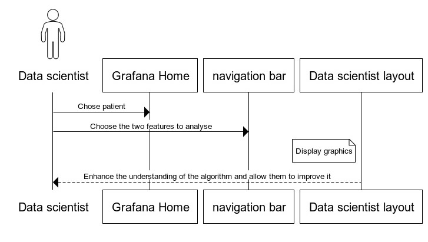

 Figure.15: Sequence diagram for the data scientist 

